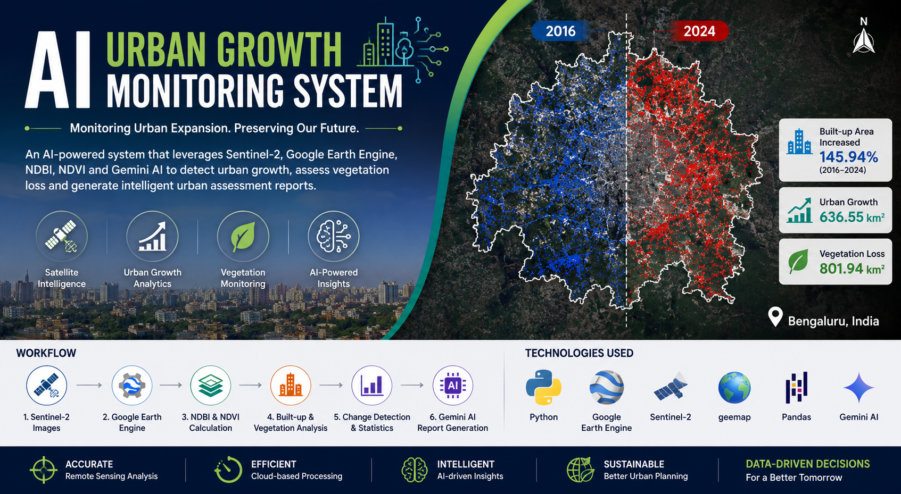
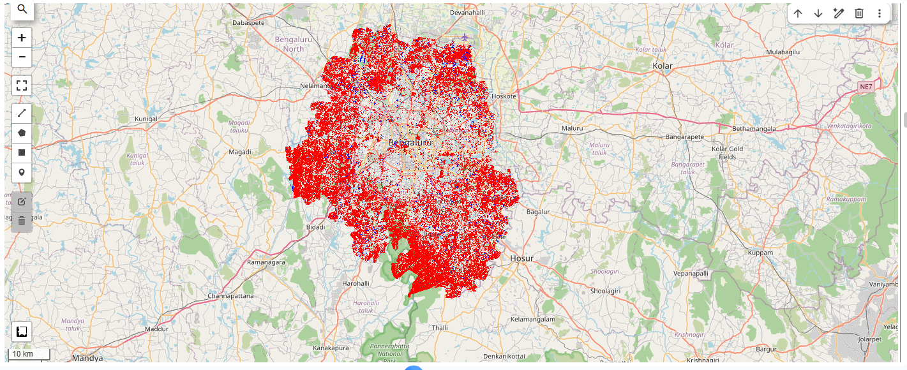
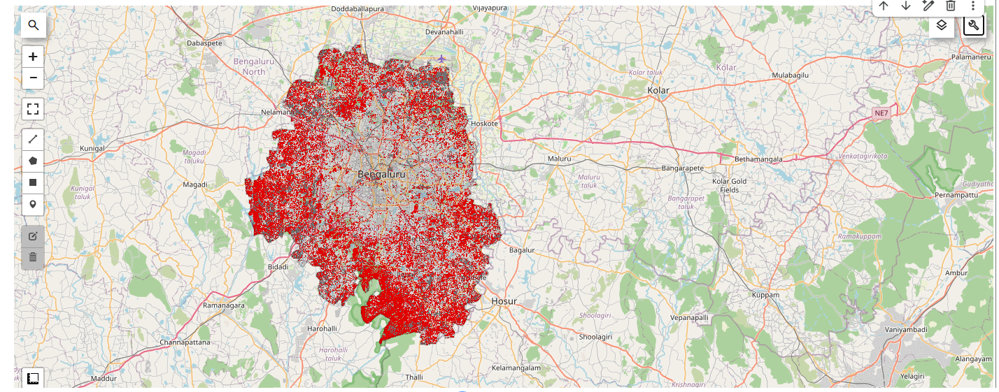
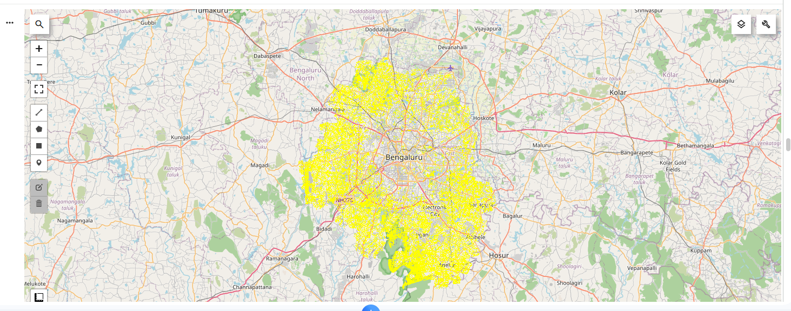
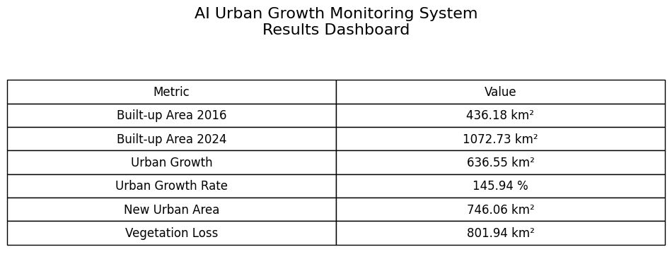
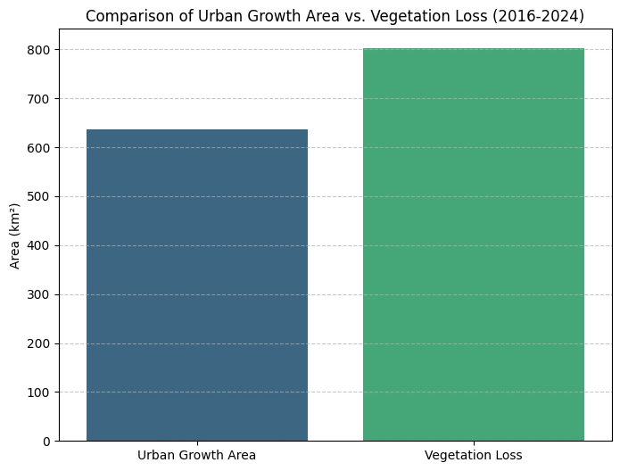

# AI Urban Growth Monitoring System

An AI-powered urban growth monitoring system using **Sentinel-2**, **Google Earth Engine**, **NDBI**, **NDVI**, and **Google Gemini AI** for urban expansion analysis, vegetation loss assessment, and automated report generation.



---

## Project Highlights

- Multi-temporal urban growth monitoring (2016–2024)
- Built-up area extraction using NDBI
- Vegetation loss assessment using NDVI
- Urban growth quantification
- Interactive geospatial visualization using Geemap
- AI-generated urban assessment reports using Google Gemini AI
- End-to-end GeoAI workflow using Google Earth Engine

---

# Project Overview

Rapid urbanization significantly alters land use, affects ecological balance, and increases pressure on natural resources. Monitoring these changes is essential for sustainable urban planning and environmental management.

This project presents an **AI-powered Urban Growth Monitoring System** that analyzes urban expansion in **Bengaluru, Karnataka, India**, between **2016 and 2024** using Sentinel-2 satellite imagery processed in Google Earth Engine.

The workflow extracts built-up areas using the **Normalized Difference Built-up Index (NDBI)**, evaluates vegetation changes using the **Normalized Difference Vegetation Index (NDVI)**, quantifies urban growth, and automatically generates a professional urban growth assessment report using **Google Gemini AI**.

This project demonstrates how GeoAI can support planners, researchers, and government agencies in making data-driven urban planning decisions.

---

# Study Area

**Location:** Bengaluru, Karnataka, India

**Study Period:** 2016–2024

---

# Workflow

```text
Sentinel-2 Satellite Imagery
            │
            ▼
Image Preprocessing
            │
            ▼
NDBI Calculation
            │
            ▼
Built-up Area Extraction
            │
            ▼
Urban Growth Detection
            │
            ▼
NDVI Calculation
            │
            ▼
Vegetation Loss Assessment
            │
            ▼
Statistical Analysis
            │
            ▼
Results Dashboard
            │
            ▼
Gemini AI Report Generation
            │
            ▼
Final Urban Growth Assessment
```

---

# Technologies Used

- Python
- Google Earth Engine
- Google Colab
- Sentinel-2 Satellite Imagery
- Geemap
- Pandas
- Matplotlib
- Google Gemini AI
- Remote Sensing
- GeoAI

---

# Methodology

The project follows these steps:

1. Acquire Sentinel-2 satellite imagery for 2016 and 2024.
2. Preprocess imagery and clip it to the Bengaluru boundary.
3. Calculate the Normalized Difference Built-up Index (NDBI).
4. Extract built-up areas using threshold-based classification.
5. Detect newly developed urban areas.
6. Calculate urban growth statistics.
7. Compute NDVI to evaluate vegetation cover.
8. Assess vegetation loss between 2016 and 2024.
9. Generate statistical summaries and visual dashboards.
10. Generate an AI-powered urban growth assessment report using Google Gemini AI.

---

# Results

| Metric | Value |
|---------|--------|
| Built-up Area (2016) | **436.18 km²** |
| Built-up Area (2024) | **1072.73 km²** |
| Urban Growth | **636.55 km²** |
| Urban Growth Rate | **145.94%** |
| New Urban Area | **746.06 km²** |
| Vegetation Loss | **801.94 km²** |

---

# Key Features

- Urban growth detection using Sentinel-2 imagery
- Built-up area extraction using NDBI
- Vegetation monitoring using NDVI
- Multi-temporal change detection
- Urban growth statistics
- Interactive GIS visualization
- AI-generated assessment reports
- End-to-end GeoAI workflow

---

# Repository Structure

```text
AI-Urban-Growth-Monitoring-System/
│
├── README.md
├── requirements.txt
├── LICENSE
│
├── notebook/
│   └── AI_Urban_Growth_Monitoring_System.ipynb
│
├── images/
│   ├── project_banner.png
│   ├── workflow_diagram.png
│   ├── Built-up Area Comparison (2016 vs 2024)
│   ├── urban_growth_map.png
│   ├── vegetation_loss_map.png
│   ├── results_dashboard.png
│   └── urban_growth_chart.png
│
├── outputs/
│   ├── Urban_Growth_Assessment_Report.txt
│   └── Urban_Growth_Results.csv
│
└── docs/
```

---

# Project Outputs

## Built-up Area Comparison (2016 vs 2024)

Blue = Built-up Area (2016)

Red = Built-up Area (2024)



---

## Urban Growth Map



---

## Vegetation Loss Map



---

## Results Dashboard



---

## Urban Growth vs Vegetation Loss



---

## AI-generated Urban Growth Assessment Report

A sample AI-generated report is available in:

```text
outputs/Urban_Growth_Assessment_Report.txt
```

---

# Applications

- Urban Planning
- Smart City Development
- Land Use Monitoring
- Environmental Impact Assessment
- Sustainable Development
- Climate Change Studies
- Government Decision Support
- GeoAI Research

---

# Future Improvements

- Annual urban growth monitoring
- Population exposure analysis
- Road network expansion analysis
- Land Surface Temperature (LST) analysis
- Urban Heat Island assessment
- Flood susceptibility analysis
- Interactive Streamlit web application
- Automatic PDF report generation
- Machine Learning-based urban classification

---

# Author

**Vishnu Venu**

GIS Analyst | GeoAI Engineer | Remote Sensing | Spatial Data Science | Python | Google Earth Engine | Generative AI

---

# License

This project is licensed under the **MIT License**.

